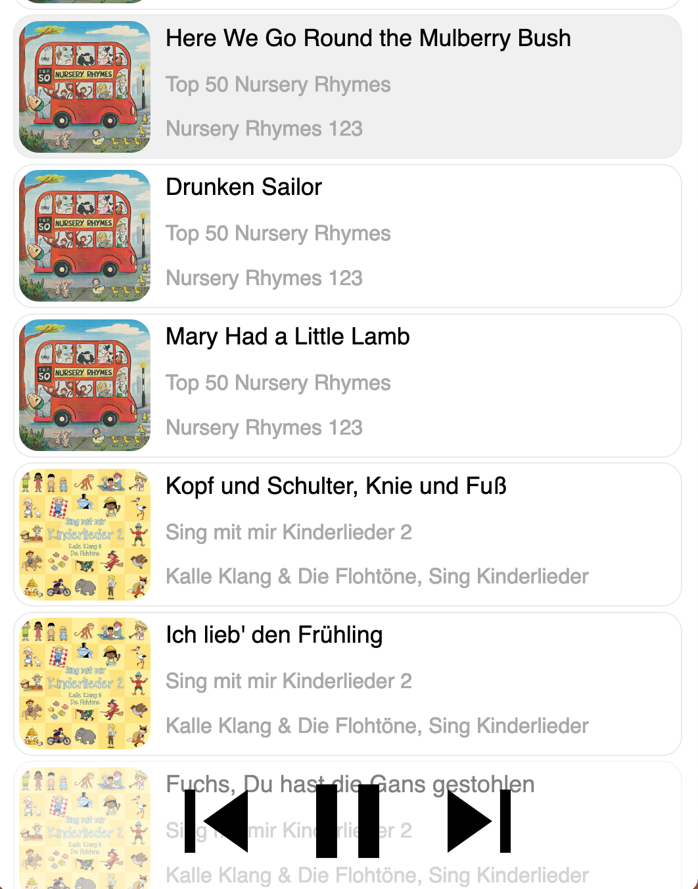

# toy-sonos-web-controller

toy-sonos-web-controller is a simple web controller developed for my kids. It displays the queue for a sonos speaker in a browser and allows control of the playing track.



## How to run it

Clone the repo and cd into the directory.
Build the react app
Create a virtual env and activate it.
Install the requirements.
Run the server.

On a mac or linux terminal this would be:
```
git clone https://github.com/andrew-1/toy-sonos-web-controller.git toy-sonos-web-controller
cd toy-sonos-web-controller
npm run build
python3.9 -m venv env
source env/bin/activate
pip install -r requirements.txt
python server.py
```

The above assumes that you have node installed and python3.9.

## How to use it

Open a browser at the IP address of the host on port 8080 and then add the name of the speaker that you want to control in lower case with punctuation removed

e.g. http://192.168.1.147:8080/livingroom to connect to a speaker called "Living Room"

To queue up a playlist add a ? followed by the name of the playlist e.g. http://192.168.1.147:8080/kidsroom?kids to connect to a speaker called "Kid's Room" and replace that speakers current queue with a sonos playlist called kids (you would need to create this playlist for this to work)

I'm using it with a playlist of my kids favourite songs. This allows them to pick the ones they like to play in a really simple interface.

## How it works
[aiohttp](https://docs.aiohttp.org/) is used to run a server.

[SoCo](http://docs.python-soco.com/) is used to control the speaker.

[React](https://create-react-app.dev/) is used for the front end.

Websockets are used to keep the page updated when there are changes to the system.
